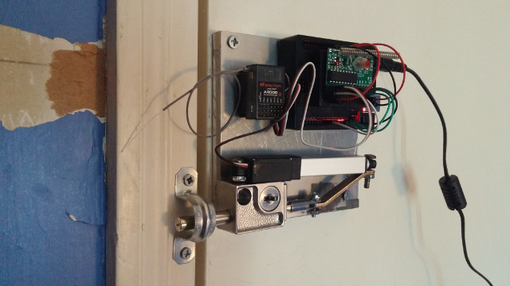

# inolock
Remote controlled security

### Table of Contents
- [Features](#features)
  - [Upcoming](#upcoming)
- [Requirements](#requirements)
  - [Software](#software)
  - [Tools](#tools)
  - [Hardware](#hardware)
- [Installation](#installation)
- [Configuration](#configuration)
- [Usage](#usage)
- [Example](#example)
- [Resources](#resources)
- [Development](#development)
  - [Future](#future)
  - [History](#history)
- [Credits](#credits)
- [License](#license)

## Features
- 315MHz RF Momentary Receiver Support
- L12-R Micro Linear Servo Support
- ProtonRev2 Linear Servo Extender Support

### Upcoming
- Finish documentation
- AR500/DX5e support
- Add unit tests
- Indiegogo campaign

## Requirements

### Software
- [git](https://git-scm.com/downloads)
- [arduino](https://www.arduino.cc/en/Main/Software)

### Tools
- Power Drill and Drill/Driver Bits
- Rotary Tool, Cut-Off Wheels, and Sanding Drums
- Hot Glue Gun and Glue Sticks
- Soldering Iron and Solder (Recommended)

### Hardware
- [U 9997 Keyed Bolt Lock](https://www.amazon.com/dp/B00176KXXA)
- [315MHz RF Momentary Receiver](https://www.adafruit.com/products/1096)
- [315MHz RF Keyfob Transmitter](https://www.adafruit.com/products/1095)
- [Connecting Arm 3D Printer STL](https://www.thingiverse.com/download:1661462)
- [L12-R Micro Linear Servo](https://www.actuonix.com/L12-R-Linear-Servo-For-Radio-Control-p/l12-r.htm) or [ProtonRev2 Linear Servo Extender](https://github.com/tscha70/3DPrinterSTLFiles/tree/master/Proton%20Rev%202%20-%20Easter%20Edition) for SG92R
- Arduino Uno R3 Microcontroller
- Arduino Uno Power Adapter
- 170 Points Breadboard
- 4 3/4" x 4 3/4" x 1/2" Plate
- 1/2" Pipe Strap or similar
- Screws, Nuts, and Bolts
- Male to Male Jumper Wires
- 315MHz Spring Antenna (Recommended)
- Arduino Uno Case (Optional)
- [Spektrum AR500 Receiver](http://www.spektrumrc.com/Products/Default.aspx?ProdId=SPMAR500) (Optional)
- [Spektrum DX5e Transmitter](http://www.spektrumrc.com/Products/Default.aspx?ProdId=SPM5500) (Optional)

## Installation
```bash
$ mkdir -vp ~/sketchbook
$ cd ~/sketchbook
$ git clone https://github.com/tuxredux/inolock.git
```

## Configuration
Set `bool L12_R_SERVO` to `true` or `false` in `linearServo.ino`.

## Usage
1. Run the Arduino IDE.
2. Select `File > Sketchbook > inolock > src`.
3. Setup and Connect the Arduino board to PC.
4. Compile and Upload to the Arduino board.
5. Mount your new door lock and try it out!

## Example
[](https://www.youtube.com/watch?v=3oUJcEJb_TY)




## Resources
- [Original Lock Project](http://www.therpf.com/showthread.php?t=245997)
- [Arduino Servo Reference](https://www.arduino.cc/en/Reference/Servo)

## Development
See [CONTRIBUTING](CONTRIBUTING.md)

### Future
See [ROADMAP](ROADMAP.md)

### History
See [CHANGELOG](CHANGELOG.md)

## Credits
See [AUTHORS](AUTHORS.md)

## License
See [LICENSE](LICENSE)
