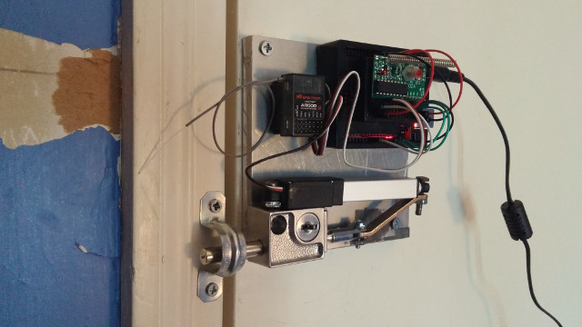

# arduino-lock
Remote controlled security!

## Features
 - 315MHz RF Momentary Receiver Support
 - L12-R Micro Linear Servo Support
 - ProtonRev2 Linear Servo Extender Support

### Upcoming
 - Finish documentation
 - AR500/DX5e support
 - Add unit tests
 - Indiegogo campaign

## Requirements

### Software
  - [git](https://git-scm.com/downloads)
  - [arduino](https://www.arduino.cc/en/Main/Software)

### Tools
 - Power Drill and Drill/Driver Bits
 - Rotary Tool, Cut-Off Wheels, and Sanding Drums
 - Hot Glue Gun and Glue Sticks
 - Soldering Iron and Solder (Recommended)

### Hardware
 - [U 9997 Keyed Bolt Lock](https://www.amazon.com/dp/B00176KXXA)
 - [315MHz RF Momentary Receiver](https://www.adafruit.com/products/1096)
 - [315MHz RF Keyfob Transmitter](https://www.adafruit.com/products/1095)
 - [Connecting Arm 3D Printer STL](https://www.thingiverse.com/download:1661462)
 - [L12-R Micro Linear Servo][1] or [ProtonRev2 Linear Servo Extender][2] for SG92R
 - Arduino Uno R3 Microcontroller
 - Arduino Uno Power Adapter
 - 170 Points Breadboard
 - 4 3/4" x 4 3/4" x 1/2" Plate
 - 1/2" Pipe Strap or similar
 - Screws, Nuts, and Bolts
 - Male to Male Jumper Wires
 - 315MHz Spring Antenna (Recommended)
 - Arduino Uno Case (Optional)
 - [Spektrum AR500 Receiver][4] (Optional)
 - [Spektrum DX5e Transmitter][3] (Optional)

## Installation
    $ mkdir -vp ~/sketchbook
    $ cd ~/sketchbook
    $ git clone https://github.com/tuxredux/arduino-lock.git

## Configuration
Set `bool L12_R_SERVO` to `true` or `false` in `linearServo.ino`.

## Usage
 1. Run the Arduino IDE.
 2. Select `File > Sketchbook > arduino-lock > src`.
 3. Setup and Connect the Arduino board to PC.
 4. Compile and Upload to the Arduino board.
 5. Mount your new door lock and try it out!

## Example

## Resources
 - [Original Lock Project](http://www.therpf.com/showthread.php?t=245997)
 - [Arduino Servo Reference](https://www.arduino.cc/en/Reference/Servo)

## Development
See [CONTRIBUTING](CONTRIBUTING.md)

## History
See [CHANGELOG](CHANGELOG.md)

## Credits
See [AUTHORS](AUTHORS.md)

## License
See [LICENSE](LICENSE), [NOTICE](NOTICE)

[1]: https://www.actuonix.com/L12-R-Linear-Servo-For-Radio-Control-p/l12-r-.htm
[2]: https://github.com/tscha70/3DPrinterSTLFiles/tree/master/Proton%20Rev%202%20-%20Easter%20Edition
[3]: http://www.spektrumrc.com/Products/Default.aspx?ProdId=SPM5500
[4]: http://www.spektrumrc.com/Products/Default.aspx?ProdId=SPMAR500
