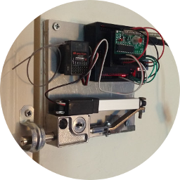

# rc-lock [](https://travis-ci.com/NathanUrwin/rc-lock)

> Remote-controlled lock :unlock:



This project was inspired by the [Replica Prop Forum thread by JohnnyNeutron](https://www.therpf.com/showthread.php?t=245997)
which in turn was inspired by [*The Amazing Spider-Man 2* (2014)](https://www.imdb.com/title/tt1872181/)
feature film, and consists of a simple Arduino [C++ software](https://github.com/trending/c++)
script and a step-by-step guide on how to create the prop replica using
[Arduino Uno hardware](https://www.arduino.cc/) and other assorted tools.

_**Disclaimer:** This is just a **hobby** project and provides absolutely no
warranty of any kind. Use at your own risk!_

## Table of Contents

- [Table of Contents](#table-of-contents)
- [Features](#features)
  - [Upcoming](#upcoming)
- [Requirements](#requirements)
  - [Software](#software)
  - [Tools](#tools)
  - [Hardware](#hardware)
- [Installation](#installation)
  - [Configuration](#configuration)
- [Usage](#usage)
  - [Examples](#examples)
- [Resources](#resources)
- [Development](#development)
  - [Future](#future)
  - [History](#history)
  - [Community](#community)
- [Credits](#credits)
- [License](#license)

## Features

- 315MHz Receiver/Transmitter Support
- L12-R Micro Linear Servo Support
- SG92R Micro Servo Support

### Upcoming

- Prop Replica Step-By-Step Guide
- Spektrum AR500 Receiver Support
- Spektrum DX5e Transmitter Support

## Requirements

### Software

- [Arduino IDE](https://www.arduino.cc/en/Main/Software)
- [Git](https://git-scm.com/downloads)

### Tools

- Power Drill and Drill/Driver Bits
- Rotary Tool, Cut-Off Wheels, and Sanding Drums
- Hot Glue Gun and Glue Sticks
- Soldering Iron and Solder (Recommended)

### Hardware

- [U 9997 Keyed Bolt Lock](https://duckduckgo.com/?q=U+9997+Keyed+Bolt+Lock)
- [315MHz RF Momentary Receiver](https://www.adafruit.com/products/1096)
- [315MHz RF Keyfob Transmitter](https://www.adafruit.com/products/1095)
- [Connecting Arm 3D Printer STL](https://www.thingiverse.com/download:1661462)
- Linear Servo Kit (Choose one of two options):
  1. [L12-R Micro Linear Servo](https://www.actuonix.com/L12-R-Linear-Servo-For-Radio-Control-p/l12-r.htm)
  2. [ProtonRev2 Linear Servo Extender](https://github.com/tscha70/3DPrinterSTLFiles/tree/master/Proton%20Rev%202%20-%20Easter%20Edition) for [SG92R Micro Servo](https://duckduckgo.com/?q=SG92R+Micro+Servo)
- [Arduino Uno Rev3 Micro controller](https://duckduckgo.com/?q=Arduino+Uno)
- [Arduino Uno Power Supply](https://duckduckgo.com/?q=arduino+uno+power+supply)
- [170 Point Mini Breadboard](https://duckduckgo.com/?q=170+point+mini+breadboard)
- 4 3/4" x 4 3/4" x 1/2" Plate
- [1/2" Pipe Strap](https://duckduckgo.com/?q=1%2F2+inch+pipe+strap) or similar
- Screws, Nuts, and Bolts
- [22 AWG Solid-core Wire](https://duckduckgo.com/?q=22+AWG+Solid-core+Wire)
- [315MHz Spring Antenna](https://duckduckgo.com/?q=315MHz+Spring+Antenna) (Recommended)
- [Arduino Uno Case](https://duckduckgo.com/?q=arduino+uno+case) (Optional)
- [Spektrum AR500 Receiver](http://www.spektrumrc.com/Products/Default.aspx?ProdId=SPMAR500) (Optional)
- [Spektrum DX5e Transmitter](http://www.spektrumrc.com/Products/Default.aspx?ProdId=SPM5500) (Optional)

## Installation

```bash
$ mkdir -vp ~/sketchbook
mkdir: created directory '~/sketchbook'

$ cd ~/sketchbook

$ git clone https://github.com/NathanUrwin/lock.git
Cloning into 'lock'...
remote: Counting objects: 132, done.
remote: Compressing objects: 100% (3/3), done.
remote: Total 132 (delta 0), reused 1 (delta 0), pack-reused 129
Receiving objects: 100% (132/132), 31.08 MiB | 2.40 MiB/s, done.
Resolving deltas: 100% (56/56), done.
```

### Configuration

Set `bool L12_R_SERVO` to `true` or `false` in `linearServo.ino`.

## Usage

1. Run the Arduino IDE.
2. Select `File > Sketchbook > rc-lock > src > RcLock`.
3. Setup and Connect the Arduino board to PC.
4. Compile and Upload to the Arduino board.
5. Mount your new door lock and try it out!

### Examples


## Resources

- [The RPF Original Thread](http://www.therpf.com/showthread.php?t=245997)
- [Arduino Servo Reference](https://www.arduino.cc/en/Reference/Servo)

## Development

See [CONTRIBUTING](CONTRIBUTING.md)

### Future

See [ROADMAP](ROADMAP.md)

### History

See [CHANGELOG](CHANGELOG.md)

### Community

See [CODE OF CONDUCT](CODE_OF_CONDUCT.md)

## Credits

See [AUTHORS](AUTHORS.md)

## License

See [LICENSE](LICENSE)
